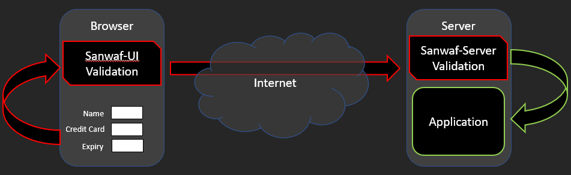
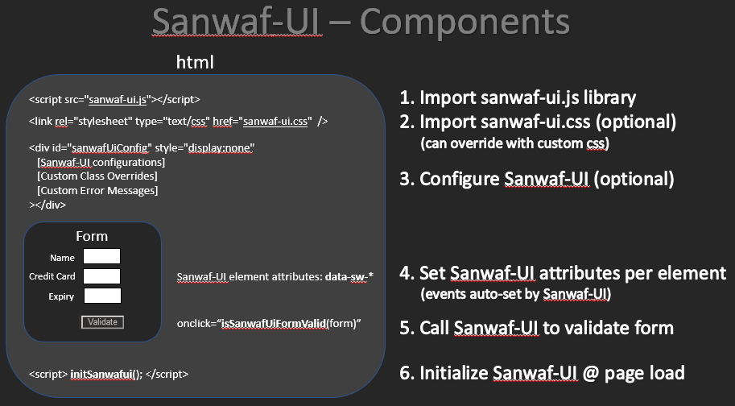

What is Sanwaf-ui & sanwaf-server
---------------------------

Sanwaf-ui is a Sanitation Web Application Firewall that runs on the browser

Sanwaf-server is a Sanitation Web Application Firewall. Sanwaf-server runs on the server

Sanwaf-server & Sanwaf-ui can be used independently or together

when used together, they provide a code-free declarative validation system on both the client & server

  
  
See [sanwaf-ui-demo.html](https://github.com/bernardo1024/Sanwaf-ui/blob/main/sanwaf-ui-demo.html) for examples...

Implementing Sanwaf-ui & Sanwaf-server
===============================

1. Developer/designer configures Sanwaf-ui on html pages

2. Run the Sanwaf-ui-2-server script to generate the server file used by Sanwaf-server to perform server-side validation

3. On your server, [add Sanwaf to your application](https://github.com/bernardo1024/SanWaf) filter chain

Configuring Sanwaf-ui
---------------------

View the source of this page to and search for "Sanwaf-ui code - STEP" to see examples of configuring sanwaf-ui (all 6 steps)  
  

1. Import sanwaf-ui.js lib

        
        
      this makes the sanwaf-ui code available for use on your page

2. import sanwaf-ui CSS (optional)

        <link rel="stylesheet" type="text/css" href="[sanwaf-ui.css](sanwaf-ui.css)" media="screen" />
        
    to specify custom classes see the [sanwafuiconfig](#sanwafuiconfig) hidden element

3. Configure sanwaf-ui (optional)

    add a hidden element named "[**sanwafuiconfig**](#sanwafuiconfig)" & configure Sanwaf-ui
    if you want to override sanwaf-ui defaults, this element must be declared

4. Set [sanwaf-ui attributes](#sanwafuitags) to per element

        <input
          type="text" id="carModel"
          data-sw-display="Car Model"
          data-sw-type="s"
          data-sw-max="30"
          data-sw-min="0"
          data-sw-req="true"
          data-sw-related="haveCar:Yes"
          data-sw-err-msg="Car Model must be entered if you own a car"
        />

    see below for [sanwaf-ui attribute](#sanwafuitags) details

5. Call Sanwaf-ui method to validate form

	checks the elements on a form for errors. returns true/false

        isSanwafUiFormValid()

	performs validate on the element specified

        sanwafUiBlurElement(element)

6. Initialize sanwaf-ui

        

script scans page for sanwaf-ui attributes setting events on elements

  
  

The "sanwafuiconfig" Hidden Element
-----------------------------------

A hidden "**sanwafuiconfig**" element is used to configure the Sanwaf-ui behavior  
  
**Optional Control Attributes**  

  	numErrorsToDisplay  		- Number of error messages to display. Specify -1 to display all errors. Defaults to: -1
  	errorActions                  	- Action(s)s to take when an error is found on a submit.  Defaults to: hoverOnLabel,hoverShowLabel,colorLabel,colorInput,onFocusDisableColors, showOnPage,showOnPageSanwafTable,alertWithPopup
	blurActions                  	- Action(s) to take when a field is blurred.  Defaults to: hoverOnLabel,hoverShowLabel,colorLabel,colorInput,onFocusDisableColors 
  	showOnPageElementId             - Optional element to wrap the sanwaf-ui errors that will be made visible if errors are detected. Defaults to: sanwafuierrorwrapper
  	showOnPageSanwafTableElementId  - Optional element to set a table of sanwaf-ui errors (configurable by css).  Defaults to: sanwafuierrortable

**Optional CSS Class Overrides**  

Use your own CSS classes by setting the following attributes to classes defined in your CSS

	labelClass 			- Sets the color for the label of the error'd element
	inputClass 			- Sets the color of the input text of the error'd element
	tooltipClass 			- The tooltip css class applied to the label
	tooltipTextClass 		- Tooltip text css specification
	sanwafErrorTableClass 		- When displaying errors on the page, a table in inserted using this css class
	sanwafErrorTableTdKeyClass 	- The css class for the key section of the sanwaf-ui error table
	sanwafErrorTableTdDescClass 	- The css class for the value section of the sanwaf-ui error table

**Optional Error Message Attributes** (default values will be used if not specified)

	errorPopHeader1 		- header line 1 used with pop-up dialog
	errorPopHeader2 		- header line 2 used with pop-up dialog
	errorRequired 			- Error message for **Required** violations
	errorMax 			- Error message for **Max Length** violations
	errorMin 			- Error message for **Min Length** violations
	errorMaxMinEqual 		- Error message for when Min & Max length are equal
	errorMaxValue 			- Error message for **Max Value** violations
	errorMinValue 			- Error message for **Min Value** violations
	errorFixedFormat 		- Error message for **Fixed Format** violations
	errorFormat 			- Error message for **Format** violations
	errorRelated 			- Error message for **Relationship** violations
	errorTypeChar 			- Error message for **Character** data type violations
	errorTypeNumeric 		- Error message for **Numeric** data type violations
	errorTypeNumericDelimited 	- Error message for **Numeric Delimited** data type violations
	errorTypeAlphanumeric 		- Error message for **Alphanumeric** data type violations
	errorTypeAlphanumericAndMore 	- Error message for **Alphanumeric and more** data type violations
	errorTypeConstant 		- Error message for **Constant** data type violations
	errorTypeRegex 			- Error message for **Regex** data type violations

  

ErrorActions & BlurActions
--------------------------

The following error actions can be used individually or cumulatively.

For example:

to set the display type to have the error message hover on the label and change the labels color:

    displayType="hoverlabel,colorlabel"

**Actions**

	hoverOnLabel 		- Add a hover element to you label that is associated with the 'for=' attribute of the label The hover is configurable via the .sawafuiTooltip elements in the sanwafy-ui.css file
	hoverShowLabel 		- Include the associated label text in the hover message
	colorLabel 		- Change the color of the label to the value specified in the .sanwafuiLabel css configuration in the sanwaf-ui.css file
	colorInput 		- Change the color of the input element to the value specified in the .sanwafinput css configuration in the sanwaf-ui.css file
	onFocusDisableColors 	- When an element gets focus, remove all error coloring (element & label)
	showOnPage 		- Element id to be made visible if an error is detected (to provide custom message)
	showOnPageSanwafTable 	- Element id to insert the Sanwaf-ui table of errors
	alertWithPopup 		- Show an alert dialog containing the Sanwaf-ui errors

  
  

Sanwaf-ui Elements Attributes
-----------------------------

	data-sw-display 	- Name Associated with the widget that will be used for display in error messages.
	data-sw-type 		- Data type of the element
	data-sw-req 		- Makes the element a mandatory field
	data-sw-max 		- Maximum character limit
	data-sw-min 		- Minimum character limit
	data-sw-max-value 	- Maximum value for the given type
	data-sw-min-value 	- Minimum value for the given type
	data-sw-format	 	- Format: Tries to best fit the data entered into the supplied mask
	data-sw-fixed-format 	- Fixed Format: The user must enter in data in exactly the same mask as indicated
	data-sw-related 	- Relate fields. format: \[related-to-element:type\] where type is '=' or 'value'
	data-sw-err-msg 	- Custom error message (overrides global msgs)

  
  

data-sw-type (data types)
-------------------------

	Character (c) 	 			Any single character
						Format: c
						Example: y, n, a, b...

	Numeric (n)				Any positive or negative numeric value
					  	('+' sign NOT allowed; one '-' sign allowed @start of value; no spaces; one '.' allowed)
					  	Format: n
					  	Example: 1000, -321.123, 0.0001

	Delimited list of numbers (n{}) 	A character separated list of numbers
						Format: n{<separator char>}  
						Note: the min & max settings applies per delimited value
						Example: using n{,}, -321.123,0.000,123,45

	Alphanumeric (a)			Valid chars are A-Z, a-z, 0-9
						Format: a
						Example: abcdefghijklmnopqrstuvwxyz0123456789ABCDEFGHIJKLMNOPQRSTUVWXYZ

	Alphanumeric & more chars (a{})		Valid chars are A-Z, a-z, 0-9 \*AND\* the characters you specify in the curly brackets  
						For \[space\], \[tab\], \[newline\], \[carriage return\] use: \\s \\t \\n \\r respectively
						Format: a{<characters to allow>}
						Example: using a{+\\s,}, abcdefghijklm nopqrstuvwxyz+

	String (s)				Any string  
						All regex's in the autoRunPatterns are executed against the string
						Format: s
						Example: "Hello this string does not contain a XSS payload"

	Constant (k{})				Constant, must be equal to one of the values specified
						Format: k{<comma separated list of strings>}
						Example: using k{FOO,BAR,FAR}, FOO, BAR, FAR are valid

	Regex (r{})				Custom Regex Expression in this file (for reuse)
						Format: r{your-regex}
						Example: r{ ^\[^\\s@\]+@\[^\\s@\]+$ } 
  

Special Sanwaf-ui Attributes
----------------------------

	data-sw-fixed-format 	- Fixed Format - data entered must be exactly as mask specified
	data-sw-format		- Format - data entered will be adjusted to fit mask specified, will error if not same as mask
	data-sw-related		- Relationships - make elements dependent on each other based on values

### Sanwaf-ui Attribute 'data-sw-fixed-format' - Fixed Format

The "data-sw-fixed-format" attribute sets the element to use an Fixed Format

An Fixed Format is way to force the end user to match your mask

For example, if you want the end user to enter a 3 digit code and require them to enter parentheses:

	  data-sw-fixed-format="(###)"

  this specifies that the element must have a parenthesis, then 3 digits, then a closing parenthesis

### Sanwaf-ui Attribute 'data-sw-format'- Format

The "data-sw-format" attribute sets the element to use a Format

A Format is way to best fit a user's entry into a mask

Sanwaf-ui automatically sets an oninput event handler to elements that have the data-ww-format attribute. the event handler formats as the user enters data

Three special characters are provided to be used in formats:

	  # - represents a number
	  A - represents an Uppercase character
	  a - represents an lowercase character

Use a combination of the special and non-special characters to create formats

For example, if you want the end user to enter a telephone number formatted in a specific way:

	data-sw-format="(###) ###-####"

  this specifies to best fist a user's entry into the specified mask.

### Sanwaf-ui Attribute 'data-sw-related' - Element Relationships

The "data-sw-related" attribute sets element relationships. Use this attribute to specify which fields are mandatory based on other related elements

For example, if you want 2 password fields, pass1 & pass2, to equal each other, you would set the "data-sw-related" attribute in pass2 as such:

	data-sw-related="pass1:="

  this specifies that pass2 is required if pass1 is populated, and their values must equal each other.

Relationships have a 2 part format:

	RelatedToElementPart : RelationshipSpecificationPart

Where "RelatedToElementPart" is the element id of the related field and "RelationshipSpecificationPart" is one of:

	none 		- ":relationshipSpecificationPart" NOT specified makes the element required if the RelatedToElementPart has any value  
  			  Example: data-sw\_related="someElement"

	\=		- Makes the element required if the RelatedToElementPart is populated; values must equal each other  
  			  Example: data-sw\_related="password **:** ="

	value		- Makes the element required if the RelatedToElementPart.value equals the value specified  
  			  Example: data-sw\_related="someElement **:** someValue"

	value1||value2	- Makes the element required if the RelatedToElementPart.value equals any of the value specified  
  			  Example: data-sw\_related="someElement **:** value1 || value2"

For complex relationships, encapsulate the 2 part format with parenthesis's "( RelatedToElementPart **:** RelationshipSpecificationPart )" and specify the && and/or the || operators

For example:   

	data-sw-type="( element1 **:** value1 || value2 ) || ( element2 **:** value1 || value2 ) && ( element3 **:** value1 || value2 )..."

 

Configuring how Sanwaf-ui Looks: Sanwaf-ui.css
----------------------------------------------

Use the sanwaf-ui.css file to configure the look and feel of sanwaf-ui in your application  
You can override all of the classes defined in the sanwaf-ui.css file by overriding them in the [sanwafuiconfig](#sanwafuiconfig) hidden element

	sanwafuiLabel 				- Sets the color for the label of the error'd element
	sanwafinput 				- Sets the color of the input text of the error'd element
	sanwafuiErrorTable 			- When displaying errors on the page, a table in inserted using this css class
	sanwafuiErrorTableTdKey 		- The <td> css class for the key section of the sanwaf-ui error table
	sanwafuiErrorTableTdDesc 		- The <td> css class for the value section of the sanwaf-ui error table
	sawafuiTooltip 				- The tooltip css class applied to the label
	sawafuiTooltip .tooltiptext 		- Tooltip text css specification
	sawafuiTooltip .tooltiptext::after	- Tooltip after specification
	sawafuiTooltip:hover .tooltiptext 	- Tooltip hover specification

